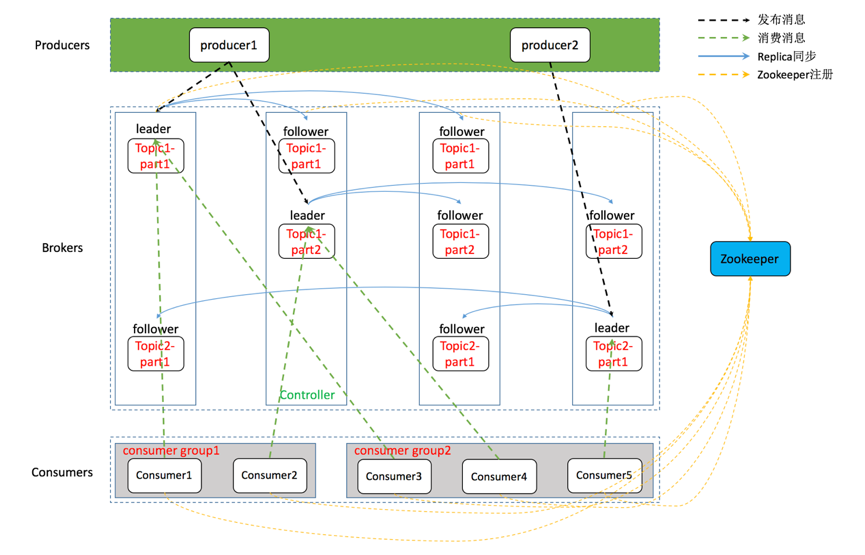

1. Kafka 总体架构
基于 Kafka-ZooKeeper 的分布式消息队列系统总体架构如下：

如上图所示，一个典型的 Kafka 体系架构包括若干 Producer（消息生产者），若干 broker（作为 Kafka 节点的服务器），若干 Consumer（Group），以及一个 ZooKeeper 集群。Kafka通过 ZooKeeper 管理集群配置、选举 Leader 以及在 consumer group 发生变化时进行 Rebalance（即消费者负载均衡，在下一课介绍）。Producer 使用 push（推）模式将消息发布到 broker，Consumer 使用 pull（拉）模式从 broker 订阅并消费消息。

上图仅描摹了一个总体架构，并没有对作为 Kafka 节点的 broker 进行深入刻画，事实上，它的内部细节相当复杂，如下图所示，Kafka 节点涉及 Topic、Partition 两个重要概念。

在 Kafka 架构中，有几个术语：

> Producer：生产者，即消息发送者，push 消息到 Kafka 集群中的 broker（就是 server）中；

> Broker：Kafka 集群由多个 Kafka 实例（server） 组成，每个实例构成一个 broker，说白了就是服务器；

> Topic：producer 向 kafka 集群 push 的消息会被归于某一类别，即Topic，这本质上只是一个逻辑概念，面向的对象是 producer 和 consumer，producer 只需要关注将消息 push 到哪一个 Topic 中，而 consumer 只需要关心自己订阅了哪个 Topic；

> Partition：每一个 Topic 又被分为多个 Partitions，即物理分区；出于负载均衡的考虑，同一个 Topic 的 Partitions 分别存储于 Kafka 集群的多个 broker 上；而为了提高可靠性，这些 Partitions 可以由 Kafka 机制中的 replicas 来设置备份的数量；如上面的框架图所示，每个 partition 都存在两个备份；

> Consumer：消费者，从 Kafka 集群的 broker 中 pull 消息、消费消息；

> Consumer group：high-level consumer API 中，每个 consumer 都属于一个 consumer-group，每条消息只能被 consumer-group 中的一个 Consumer 消费，但可以被多个 consumer-group 消费；

> replicas：partition 的副本，保障 partition 的高可用；

> leader：replicas 中的一个角色， producer 和 consumer 只跟 leader 交互；

> follower：replicas 中的一个角色，从 leader 中复制数据，作为副本，一旦 leader 挂掉，会从它的 followers 中选举出一个新的 leader 继续提供服务；

> controller：Kafka 集群中的其中一个服务器，用来进行 leader election 以及 各种 failover；

> ZooKeeper：Kafka 通过 ZooKeeper 来存储集群的 meta 信息等，文中将详述